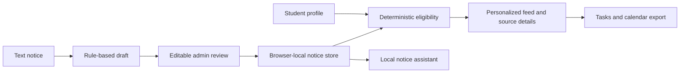

# CampusPulse AI

A working, responsive campus opportunity website built with Next.js, TypeScript, locally hosted DM Sans / Manrope, Lucide icons and Recharts. Impeccable is installed in `.agents/skills/impeccable` and was used for the design workflow. No Sites tooling was used.

## Run locally

```bash
npm install
npm run dev
```

Open http://localhost:3000. For production: `npm run build` then `npm start`.

## What works

- Personalized dashboard with priority notices, filters, saved opportunities and a weekly agenda.
- Opportunity detail with deterministic branch, year, CGPA and backlog comparisons plus original notice evidence.
- Five switchable student profiles. Rahul (8.1 CGPA) qualifies for Infosys; Aman (6.6) does not.
- Task completion persisted per student, saved opportunities, hidden notices and profile editing.
- Monthly calendar, agenda, notifications and downloadable ICS events with a one-day reminder.
- Local assistant matching common questions to source-linked campus notices.
- Notice studio: upload `.txt` or paste text, prepare a rule-based draft, edit fields, review audience eligibility, and publish to the feed. Exact duplicate source text is rejected.
- Analytics calculated from the local demo data, global search with Ctrl/Cmd+K, responsive layout and keyboard focus states.

## Decision-engine upgrade

- **Calculated impact:** eligibility (30%), relevance (25%), deadline urgency (20%), career impact (15%) and effort efficiency (10%). Scores update with your profile; ineligible/expired opportunities are capped. The explanation panel shows the factors without forcing users to read a formula.
- **Priority tasks:** Must do / Recommended / Information classifications; must-do items appear first, and the agenda uses chronological deadline order.
- **Action graph:** registration → resume → assessment → conditional interview. Dependencies lock downstream actions, undoing a prerequisite clears descendants, and shortlist outcomes change the path.
- **Focus mode:** `/focus` offers 15/30/60 minutes and a custom budget. It greedily selects one ready action per opportunity, protecting urgent work first, without exceeding available time. It is a deterministic heuristic, not a mathematical global optimum.
- **Consequences:** detail pages compare skipping versus acting; profile simulates AWS/Azure/Google Cloud certification unlocks against actual notice rules. The demo contains three AWS-gated opportunities.
- **Resume:** profile upload accepts PDF/DOCX/TXT up to 5 MB, stores the actual file in IndexedDB per student, and supports replacement, download and removal. It persists across reloads. Files never go to AI or employers, and their contents are not parsed for skills.
- **Notice analyzer:** `/analyze` calls `/api/analyze`, reviews extracted fields and action dependencies, computes impact, and publishes into the opportunity feed. Unknown fields remain unknown. Local extraction only accepts explicit date/time patterns and conservatively leaves unsupported fields for review.
- **Assistant:** priorities, time budgets, eligibility, explanations, consequences, comparisons and certification unlocks use a deterministic decision engine. An optional `/api/query` request adds a grounded AI explanation.
- **Twelve varied notices** include urgent TCS hiring, three placements, scholarships, academic tasks, a hackathon, missing requirements and an information-only notice. Existing browser data is migrated without deleting user-added notices or task history.

### Optional live AI

Copy `.env.example` to `.env.local`, set `OPENAI_API_KEY` and `OPENAI_MODEL` to a Responses-compatible structured-output model available to your account, and restart the dev server. Never put the key in a `NEXT_PUBLIC_` variable. With no credentials or a provider error, the website explicitly shows the local fallback. Live provider calls require credentials and were not exercised in the credential-free tests.

The integration follows [OpenAI Structured Outputs](https://developers.openai.com/api/docs/guides/structured-outputs). Scores and final eligibility remain deterministic. Notice analysis sends only pasted notice text; optional assistant explanations send the current decision facts and referenced notices, never the resume file.

## Demo journey

1. Start at `/dashboard` as Rahul.
2. Open Infosys and inspect all four eligibility checks and source evidence.
3. Download a reminder and mark the task complete.
4. Visit `/profile`, switch to Aman, and reopen Infosys to see the failing CGPA criterion.
5. Visit `/admin`, choose New notice → Use sample notice → Prepare review.
6. Review fields, confirm the notice, publish, then find FutureWorks in `/opportunities`.
7. Visit `/assistant` and ask which deadlines are tomorrow.

## Honest demo boundaries

This implementation is a frontend website with browser-local persistence, not a deployed multi-user backend. All notices and student records are synthetic. The demo clock is fixed to **16 September 2026, 09:00 IST** so the narrative stays reproducible. Clearing browser storage resets it.

There is no authentication, Supabase database, pgvector retrieval, OCR/PDF/DOCX text extraction, email delivery or external application submission. No credentials are needed for demo mode; live AI is optional as described above. Eligibility and impact scores are calculated, while career impact and task effort are transparent planning estimates. Calendar reminders must be imported into the user's calendar. Admin and student roles are demo navigation, not access-control boundaries. Resume storage supports PDFs/DOCX as files without extracting their contents.

## Architecture



`components/campus-app.tsx` owns the application shell and local state; `opportunity-card.tsx` and `notice-admin.tsx` provide reusable feature surfaces. `lib/data.ts` holds typed fixtures, eligibility, date handling and ICS export. Styles are token-based in `app/globals.css`.

## Verification

```bash
npm test
npm run typecheck
npm run build
# With dev server running:
npx playwright install chromium
node tests/browser.mjs
node tests/upgrade-browser.mjs
node tests/keyboard.mjs
```

Unit tests cover deterministic eligibility, boundary values, uncertainty and deadline ordering. Browser checks cover dashboard rendering, task completion, student switching, notice publishing, source-grounded assistant results, mobile overflow and runtime errors. Screenshots are in `.impeccable/review/`.

## Future integration points

Replace local storage with authenticated Supabase tables, move parsing into a validated backend with Docling/OCR, add provider-backed structured extraction and grounded retrieval, and connect delivery services. Preserve the deterministic eligibility engine and source evidence when adding AI.
